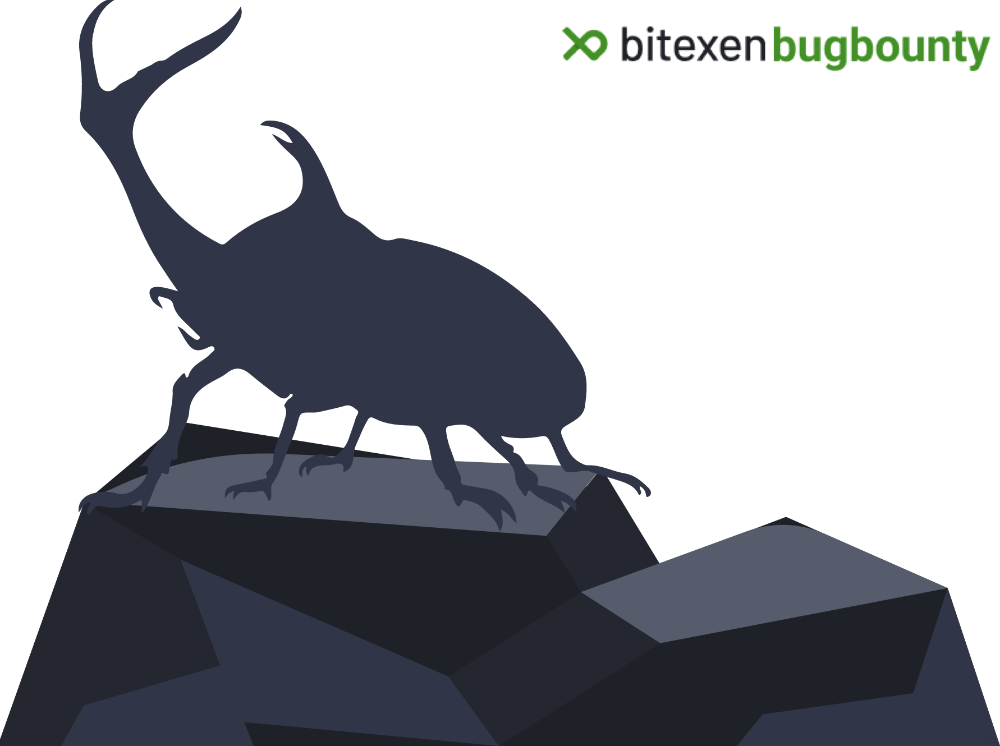

[]([https://www.google.com/](https://bugbounty.bitexen.com))

# Bitexen Güvenlik Açığı Bildirim Programı

Bitexen Güvenlik Açığı Bildirim Programına hoş geldin. Türkiye’nin en büyük kripto borsalarından biri olarak kullanıcılarımıza güvenli bir platform sağlamak ana önceliklerimizden biridir. Bu nedenle herkesi Bitexen Güvenlik Açığı Bildirim Programımıza katılmaya davet ediyoruz. Bu programla araştırmacı ve hacker'ları güvenlik açıklarını sorumlu bir şekilde bulmaya, bildirmeye ve bu açıkları gidermemize yardımcı olmaya teşvik ediyoruz. 

Benzer güvenlik açığı bildirim programlarında olduğu gibi Bitexen Güvenlik Açığı Bildirim Programında da hem bizleri hem de güvenlik açığı bildirenleri korumaya yönelik oldukça net ve basit kurallar var. 

Bitexen Güvenlik Açığı Bildirim Programına dair sormak istediğin soruları bugbounty@bitexen.com adresine iletebilirsin.

Katıldığın için teşekkürler ve iyi avlanmalar! ¯\\\_(ツ)\_/¯

## Kurallar

- Aynı güvenlik açığı için gelen ilk rapor kabul edilir.
- Bitexen tarafından halihazırda bilinen açıklıklar için gelen raporlar kabul edilmez.
- Bulunan zafiyetleri Bitexen izni olmadan başka platformlarda paylaşmayınız. Paylaşıldığı tespit edilen raporlar ödül hak edişini kaybeder.
- Kapsamda listelenmemiş ancak Bitexen'e ait hedefler için gönderilen raporlar ödül programı dışında tutulur.
- Kapsam dışı olarak belirtilen zafiyetler için gönderilen raporlar kabul edilmez.
- Sistemlerin zarar görmemesine ve kişisel verilerin gizliliğine önem verilmelidir.
- Diğer kullanıcı verilerine erişilmemeli, değiştirilmemeli, tüm testler kontrolünüzdeki hesaplar ile gerçekleştirilmeli. Kullanıcı verilerine erişim yetkisi doğurabilecek zafiyetleri doğrulamadan veya yalnızca kendi hesaplarınız üzerinde doğrulayarak iletebilirsiniz.
- Sosyal mühendislik yöntemleri (phishing, vishing, smishing vb.) ve fiziki saldırılar (bilgisayar hırsızlığı, SIM kart kopyalanması vb.) kullanılmamalı. Hizmet kesintisine yol açabilecek (DoS) saldırılar denenmemelidir.
- Raporlar Türkçe veya İngilizce olarak iletilebilir.
- Güvenlik açığı hakkındaki tüm detayların paylaşılması, PoC verilmesi gerekmektedir. Örnek rapor formatlarına [report-templates](https://github.com/Bitexen/bitexen-bugbounty/tree/master/report-templates) sayfasından ulaşabilirsiniz.
- Birden fazla güvenlik açıklığı kullanılarak zincirleme güvenlik açıklığının tespit edildiği durumlarda ayrı ayrı raporlama yapılabilir.

## Risk Kategorilendirmesi

Raporlanan güvenlik açıklarını etkilerine göre dört kategori altında sınıflandırdık. Listede bulunmayan güvenlik açıkları potansiyel etkisine göre değerlendirilecektir.

### Kritik

- Kullanıcı hesaplarından yetkisiz bir şekilde token elde edilebilmesi veya para çıkışı yapılabilmesi
- Hassas kullanıcı bilgilerinin (kimlik verisi, adres, telefon vb.) açığa çıkması
- Bitexen sunucularında uzaktan kod çalıştırma
- Kullanıcı hesaplarına login veya MFA fonksiyonları atlatılarak erişilebilmesi (Sosyal mühendislik ve kaba kuvvet saldırıları kapsam dışıdır)
- İş mantığı atlatılarak işlem yapılması (coin alımlarında fiyat değiştirilebilmesi vb.)
- Şifreleme, imzalama, doğrulama fonksiyonlarının etkilenmesi

### Yüksek

- Kullanıcı cüzdan bilgilerinin (sahip olunan tokenler, para miktarı vb.) açığa çıkması
- Bitexen sunucularında uzaktan kod çalıştırma (yetkisiz kullanıcı)
- Halka açık erişimde bırakılmış kritik veri barındıran (e-posta adresleri, parolalar, iletişim verileri gibi. Etki sınıflandırması bulunan datanın önemine göre değişebilir.) sunucuların tespit edilmesi (Örn. AWS S3)
- CSP atlatılarak XSS (Reflected ve self XSS hariç) güvenlik açığının tespit edilmesi

### Orta

- Bitexen uygulamaları üzerinden mobil cihazda kod çalıştırma

### Düşük

- Sunucularda kritik olmayan, başka bir saldırıyla birleştirilemeyen bilgi ifşası güvenlik açıklıkları

## Ödüller

Aşağıdaki tablo, belirtilen kategoride verilecek en büyük ödül miktarını göstermektedir. Geçerli bir rapor iletildiği durumda verilecek ödül miktarı rapor özelinde hesaplanacaktır. Yüksek kalite raporlama yapılması, raporlama ve çözüm sürecinde yardımcı olunması gibi durumlarda ek ödüller kazanabilirsiniz.

| Kritik     | Yüksek     | Orta      | Düşük     |
|------------|------------|-----------|-----------|
| USD 3.000  | USD 1.000  | USD 250   | USD 50    |

Bitexen, belirtilen ödül miktarlarını haber vermeden değiştirme hakkına sahiptir. Raporun Bitexen'e sunulduğu tarihteki güncel ödül miktarı dikkate alınır. Kazanılan ödül, Bitexen hesaplarına tercihinize göre BTXN veya USDT olarak aktarılacaktır.

### Ödül Alma Kriterleri

- Bitexen çalışanları ve birinci derece yakınları ödül kazanamaz.
- Ödül hakkı kazanmak için minimum 14 yaşında olunmalıdır.
- Bulgu halka açık şekilde paylaşılmamalıdır.
- Ödülün verilmesinin önünde hukuki bir engel bulunmamalıdır.

## Kapsam

| Hedef Uygulama | Domain/Adres                                               |
|----------------|------------------------------------------------------------|
| Domain         | www.bitexen.com/*                                          |
| Domain         | bitexen.com/*                                              |
| Android App    | Bitexen (com.bitexen.exchange)                             |
| IOS App        | Bitexen (ID 1388036461)                                    |
| Smart Contract | 0xe6cc10ef4de1ccfb821c99c04abfe1859d8eab8f (BTXN) (ERC20)  |
| Smart Contract | 0xbcf91e60a6719eb3e9308addf1f7c6185c2af889 (XNP) (ERC20)   |

Not: Akıllı sözleşmelerin kodlarına https://etherscan.io/ adresinden ulaşabilirsiniz.

## Kapsam Dışı

- Kapsam listesinde belirtilmeyen domainler ve uygulamalar (Kritik veya yüksek dereceli güvenlik açıkları kapsam dahilinde değerlendirilebilir)
- Güvenlik açığı bulunan kütüphaneler ve versiyonlar (Etki oluşturan PoC veya sömürü yöntemi bulunuyorsa kapsam dahilinde değerlendirilebilir)
- Teorik, PoC sağlanamayan veya etki oluşturmayan saldırılar
- Otomatize araç ve tarama raporları
- Tekrarlanamayan güvenlik açıkları
- Kaba kuvvet ve sosyal mühendislik saldırıları
- DoS saldırıları (DoS sebebi olabilecek bir güvenlik açıklığı bulduğunuzda doğrulamadan iletiniz)
- Self XSS
- Zayıf veya sızmış parola kullanımına dayalı saldırılar
- Giriş ve çıkış fonksiyonlarında CSRF güvenlik açıkları
- HTTP başlıklarındaki güvenlik eksikleri
- Cookie flag eksikleri
- Kritik olmayan sunucularda bilgi ifşasına yol açabilecek güvenlik açıkları
- Bitexen çalışan hesabına veya iç ağ erişimine ihtiyaç duyulan saldırılar
- MITM veya fiziksel erişim gerektiren saldırılar
- Cache Poisoning güvenlik açıkları
- SSL/TLS konfigürasyon eksiklikleri (TLS 1.1 kullanımı vb.)
- E-Posta konfigürasyon eksiklikleri (SPF/DMARC/DKIM kayıtları vb.)
- Etki oluşturduğu (cookie hırsızlığı gibi) ispat edilemeyen Open Redirects güvenlik açıkları
- Rate limiting bulunmayışı (Rate limiting bulunan sistemlerde rate limit atlatılması kapsam dahilinde değerlendirilecektir)
- UX ve UI problemleri
- Username enumeration güvenlik açıkları
- Yalnızca güncel olmayan tarayıcı, işletim sistemi veya platformlarda istismar edilebilen güvenlik açıkları
- Kullanılan üçüncü taraf uygulamalarda bulunan güvenlik açıkları
- "Best Practice" kabul edilen kontrollerde eksiklikler
- Mobil cihazlarda root, jailbreak veya cihaz modifikasyonu gerektiren güvenlik açıkları

Kapsam dışı olarak belirtilmemiş sistemler/güvenlik açıkları konusunda sorularınızı iletebilirsiniz.

## Test ve Raporlama

Testleriniz sırasında oluşan trafiği saldırgan trafiği ile karıştırmamamız için aşağıdaki yöntemleri uygulayarak bize yardımcı olabilirsiniz.

- Özel HTTP başlıkları kullanabilirsiniz. Örnek:
  - X-BTXN-VDP: <kullanıcı mail adresi>
- Raporda IP adresinizi belirtebilirsiniz.

Test sürecinde yalnızca kontrolünüzdeki hesapları kullanmaya dikkat ediniz. Sistemler üzerinde komut çalıştırmaya yönelik bir güvenlik açığı bulduysanız yalnızca ```id``` ve ```hostname``` komutlarını kullanınız. Otomatize araçlar kullanmayınız. Potansiyel olarak hasara yol açabilecek bir güvenlik açığı bulduysanız doğrulamadan önce bizim ile iletişime geçerek ek test izinleri alınız.

Uzaktan kod çalıştırma güvenlik açıkları için izin verilen/verilmeyen aksiyonlar:

- İzin verilenler
  - Web önyüzünde bulunan input alanlarında zararsız komut denemeleri (```whoami```, ```hostname```, ```ifconfig```gibi)
  - Zararsız bir komutu hard-coded olarak çalıştıran dosya yüklemeleri
  - Sömürülen güvenlik açığının ispatı için ```id``` ve ```hostname```komutları
- İzin verilmeyenler
  - Serbest komut çalıştırmaya yol açabilecek dosya yüklemeleri (webshell vb.)
  - Dosya silinmesi, düzenlenmesi, izinlerin değiştirilmesi
  - Normal operasyonlara etki edebilecek aksiyonlar (reboot vb.)
  - Güvenlik açığının ispatı için gerekli olanlar dışında çalıştırılan komutlar ve dosya erişimleri

Uzaktan kod çalıştırma güvenlik açıkları raporlanırken aşağıdaki bilgileri de ekleyiniz:

- Kaynak IP adresi, hedef IP adresi ve port bilgileri
- Timestamp
- Sunucuya yapılan istekler ve cevaplar
- Test sırasında bilerek veya bilmeyerek erişilmiş olan dosyalar, dizinler

Rapor taslağımızı kullanırsanız mutlu oluruz :)

## Güvenli Liman

Bitexen, bu sayfada belirtilen kurallara uyularak yapılan araştırmalar ve raporlamalar için herhangi bir hukuki aksiyon almayacaktır.

Rapor gönderilmesi halinde, gönderilen içeriğin haklarının Bitexen'e devredildiği kabul edilir.

Program kapsamında sunulan raporlardaki güvenlik açıklarının Bitexen haricindeki üçüncü partilerin ürün ve hizmetlerine, ağ yapılarına, sistemlerine, uygulamalarına ve bilgilerine dair olması durumunda, ilgili raporlar Bitexen Güvenlik Açığı Bildirim Programı kapsamında değerlendirilmez ve dolayısıyla ilgili üçüncü partilerin bu tarz bir raporlama durumunda yasal işlem başlatabileceğini ve bu durumdan Bitexen olarak sorumlu olmadığımızı bildirmek isteriz. Bitexen kendi ürün ve hizmetleri dışındaki güvenlik araştırmalarına izin vermez ve herhangi bir kişiye bu konuda bir yetkilendirme sunmaz.

Bitexen Güvenlik Açığı Bildirim Programına dair detaylı kuralların ve hukuki bilgilerin yer aldığı dokümana [policy-details](https://github.com/Bitexen/bitexen-bugbounty/tree/master/policy-details) sayfasından ulaşabilirsiniz.

Mutlu avlar! ᕕ( ᐛ )ᕗ

_Bitexen Güvenlik Açığı Bildirim Programı sistemlerimizde bulunabilecek güvenlik açıklarından kontrollü bir şekilde haber almak ve araştırmacıları teşvik etmek için hazırlanmıştır. Eğer Bitexen hesabınızın güvenliğinin ihlal edildiğini düşünüyorsanız en kısa zamanda şifrenizi değiştiriniz ve destek@bitexen.com aracılığıyla destek ekibimizle iletişime geçiniz._
